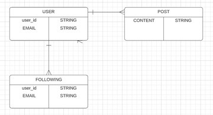
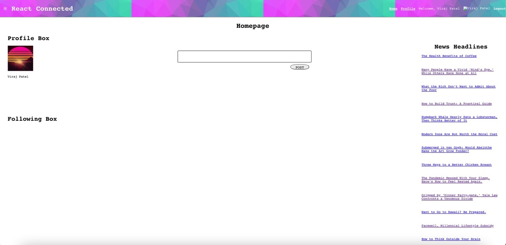

# Connected, a social media posting application
### Connected is a social media application that allows users to perform CRUD operations on their posts and comments on other's posts. It features authentication with firebase and NYT News API.

## Technologies 
* MongoDB, Mongoose
* Express
* React.js
* Node.js
* CSS3
* NYT News API

## ERD

## Wireframe

## Get Started

[Click here]( https://react-connected.netlify.app/ ) to get started

## Future Enhancements 
* Add a comments feature so users can add/delete/edit comments to other user's posts.
* Allow each user to follow and un-follow other users
* Implement feature such that posts of their followed users appear first in a user's feed.
* Add elements to the profile page such that it displays each user's profile image, bio, accomplishments, followers, and following.

## What I learned
* While making this project I learned the basics of React! 
* I was able to delve into the use cases of and implement React props and hooks!
* I was able to connect an API to my project!
* I became comfortable with styling React components!